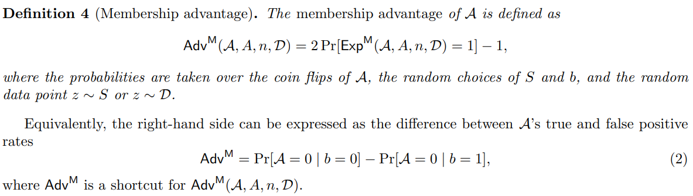

## Tensorflow Privacy - MIA Risc Scores

### 1. Adv - `Membership Advantage`

   > Calculates membership attacker's (or adversary's) advantage. 
    This metric is inspired by https://arxiv.org/abs/1709.01604, specifically
    by Definition 4. The difference here is that we calculate maximum advantage
    over all available classifier thresholds.
      
         max(np.abs(tpr - fpr))

   

### 2. PPV - `Positive Predictive Value of the membership attacker` 
   > Calculates Positive Predictive Value of the membership attacker.
    Defines the proportion of positive predictions that are true positives.
    It was suggested in https://arxiv.org/pdf/2005.10881.pdf
    that this would be a <b>suitable metric for membership attacks on datasets
    where the number of samples from the training set and the number of samples
    from the test set are very different.</b> These are referred to as imbalanced
    datasets.

         PPV=TP/(TP+FP)

### 3. AUC - `Area Under Curve` 

### 4. LiRA via Offset

### 4. LiRA via Offset
